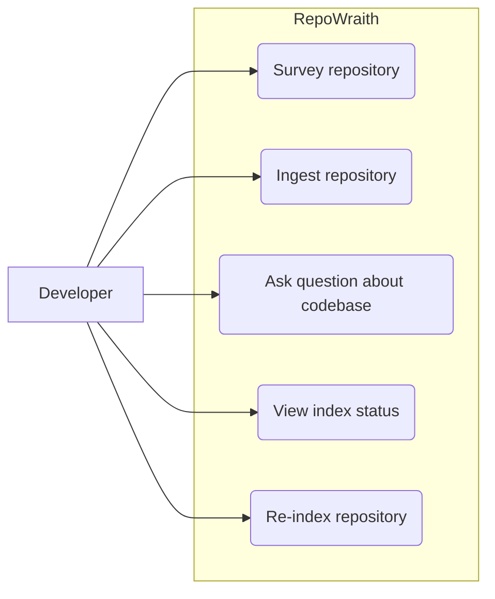

```mermaid
flowchart LR

    developer[Developer]

    subgraph system[RepoWraith]
        survey(Survey repository)
        ingest(Ingest repository)
        ask(Ask question about codebase)
        status(View index status)
        reindex(Re-index repository)

    end

    developer --> survey
    developer --> ingest
    developer --> ask
    developer --> status
    developer --> reindex


```
