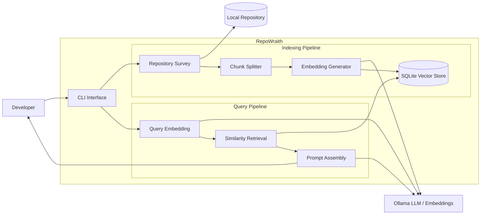

# RepoWraith Architecture Overview

This diagram illustrates the high-level architecture of RepoWraith,
showing the indexing pipeline used to build the repository index
and the query pipeline used to answer developer questions.

