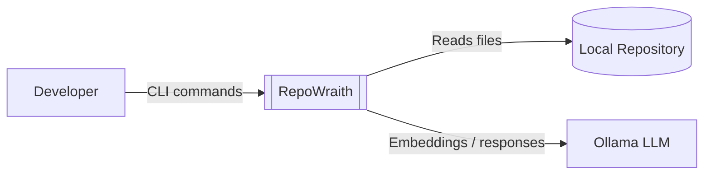

# RepoWraith — System Context

This diagram shows the external actors and systems that interact with RepoWraith.

RepoWraith operates as a local tool that reads source code from a repository and uses a local language model via Ollama to generate embeddings and answers to developer queries.

